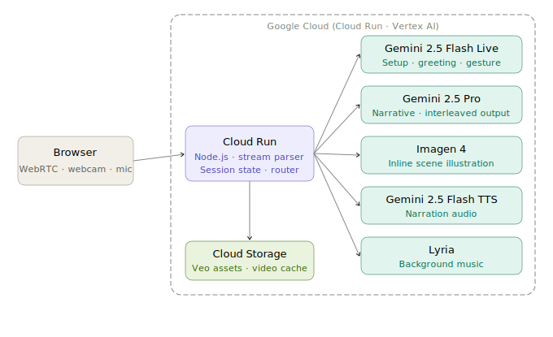

# FableGenie 🧞

> Talk to it. Interrupt it. Gesture at it. Every story is generated fresh — no two are ever the same.

**Hackathon:** Gemini Live Agent Challenge
**Category:** Creative Storyteller
**Live demo:** [exportgenie.ai](https://exportgenie.ai)

---

## What it does

FableGenie is a fully generative, real-time multimodal storytelling platform. You tell it what kind of story you want — by voice or by clicking — and it builds a completely original fable from scratch. The narrator sees you through your webcam, responds to your spoken questions mid-story, reads your hand gesture to branch the plot, and generates illustrations and ambient music inline as the story unfolds.

**Every story is unique. Nothing is pre-written.**

---

## Six models. Three uses of Gemini Live.

| Model | Phases | Role |
|---|---|---|
| Gemini 2.5 Flash Live | 0, 1, 3 | Story setup conversation → personalized greeting → gesture detection |
| Gemini 2.5 Pro | 2, 4, 5 | Generative fable with inline image + music routing tags |
| Imagen 4 (ultra-fast) | 2, 4 | Scene illustrations, triggered inline from the narrative stream |
| Gemini 2.5 Flash TTS | 0–5 | All spoken audio, per-phase style and pacing |
| Lyria | 2, 4 | Generative ambient music keyed to story mood |
| Veo 3.1 | 4 | Two cinematic branch-resolution clips stored in GCS |

Gemini Live plays three distinct roles across the session — story configurator, room-aware greeter, and gesture reader. That's the core of what makes this multimodal rather than just a text-to-speech wrapper.

---

## How a session works

```
Phase 0 — Voice Setup
  User talks to Gemini Live: "I want a story about a fox who learns patience"
  Live extracts parameters silently, transitions to the fable

Phase 1 — The Hook
  Gemini Live sees the user's room, delivers a personalized greeting

Phase 2 — Generative Narrative
  Gemini Pro builds and streams a fresh fable
  [IMAGE:] tags → Imagen 4 illustrations fade in inline
  [MUSIC_MOOD:] tags → Lyria ambient music crossfades
  User can interrupt at any time with spoken questions

Phase 3 — Gesture Branch
  At a naturally dramatic moment, the story pauses
  User shows thumbs up (trust) or crosses arms (run away)
  Gemini Live reads the gesture and confirms the branch

Phase 4 — Resolution
  Veo cinematic clip plays as backdrop
  Pro narrates the story-specific ending with fresh illustrations

Phase 5 — Moral Reflection
  The moral connects back to something Gemini noticed in the user's room
```

---

## Architecture



```
Browser (WebRTC + WebSocket)
    ├── webcam + mic → Cloud Run backend
    ├── ← TTS audio chunks (overlapping synthesis)
    ├── ← Imagen 4 illustrations (base64, WebSocket)
    ├── ← Lyria ambient loops (base64, WebSocket)
    └── ← Signed GCS URL for Veo clip

Cloud Run — Node.js backend
    ├── Session state machine (6 phases)
    ├── Chunk-boundary-safe stream parser
    ├── Overlapping TTS synthesis pipeline
    ├── WebSocket reconnection protocol
    ├── Dynamic system prompt builder
    └── → Vertex AI (all model calls, us-central1)
          ├── Gemini 2.5 Flash Live
          ├── Gemini 2.5 Pro
          ├── Imagen 4
          ├── Flash TTS
          └── Lyria

Cloud Storage (GCS)
    ├── trust_resolution.mp4   (Veo 3.1, mood-based)
    └── run_away_resolution.mp4 (Veo 3.1, mood-based)
```

---

## Tech stack

- **Backend:** Node.js 20, `@google/genai` SDK, `ws` (WebSocket), Express
- **Frontend:** Vanilla JS, Web Audio API, WebRTC — no framework, no build step
- **AI routing:** Vertex AI, us-central1 — all model calls
- **Cloud:** Cloud Run, Cloud Storage, Container Registry
- **IaC:** Terraform (`terraform/`) + `deploy.sh`
- **Domain:** exportgenie.ai

---

## Repository structure

```
fable-genie/
├── backend/
│   ├── src/
│   │   ├── server.js           # Express + WebSocket entry point
│   │   ├── sessionManager.js   # State machine: SETUP → GREETING → NARRATING → ...
│   │   ├── streamParser.js     # Chunk-boundary-safe tag parser
│   │   ├── promptBuilder.js    # buildSystemPrompt({setting, moral, userIdea, userName})
│   │   ├── geminiLive.js       # Gemini 2.5 Flash Live wrapper (3 role modes)
│   │   ├── geminiPro.js        # Gemini 2.5 Pro streaming wrapper
│   │   ├── imagen.js           # Imagen 4 with locked style prefix
│   │   ├── tts.js              # Overlapping TTS synthesis pipeline
│   │   ├── lyria.js            # Lyria mood loop generator
│   │   └── gcs.js              # GCS signed URL fetcher
│   ├── Dockerfile
│   └── package.json
├── frontend/
│   ├── index.html              # Setup screen + theater mode UI
│   ├── main.js                 # WebSocket client, Web Audio mixer, WebRTC
│   └── style.css
├── assets/
│   └── veo-prompts/
│       ├── trust_resolution.txt
│       └── run_away_resolution.txt
├── terraform/
│   ├── main.tf                 # Cloud Run, GCS (with CORS), IAM
│   └── variables.tf
├── deploy.sh
├── .env.example
├── PRD_v4.md
└── README.md
```

---

## Prerequisites

- Google Cloud project with billing enabled
- APIs enabled: Vertex AI, Cloud Run, Cloud Storage, Container Registry
- `gcloud` CLI authenticated (`gcloud auth login`)
- Docker installed and running
- Node.js 20+

---

## Local development

### 1. Clone and install

```bash
git clone https://github.com/thisisthedarshan/FableGenie.git
cd FableGenie
cp .env.example .env
# Fill in your values (see Environment Variables below)
cd backend && npm install
```

### 2. Environment variables

```env
GOOGLE_CLOUD_PROJECT=your-project-id
VERTEX_AI_LOCATION=us-central1
GCS_BUCKET=fable-genie-assets
PORT=8080
```

### 3. Run locally

```bash
node backend/src/server.js
```

Open `frontend/index.html` directly in Chrome. No build step needed.

> Chrome requires HTTPS for webcam access except on `localhost`. Local dev works on `localhost:8080` without HTTPS. For any other hostname, use `ngrok` or deploy to Cloud Run.

---

## Cloud deployment

### One-command deploy

```bash
chmod +x deploy.sh
./deploy.sh
```

Builds the Docker image, pushes to Container Registry, deploys to Cloud Run with `min-instances: 1` (no cold starts).

### Terraform (full infrastructure)

```bash
cd terraform
terraform init
terraform apply -var="project_id=YOUR_PROJECT_ID"
```

Provisions Cloud Run, GCS bucket with CORS for `exportgenie.ai`, and IAM bindings.

### Custom domain

```bash
gcloud run domain-mappings create \
  --service fable-genie-api \
  --domain exportgenie.ai \
  --region us-central1
```

Add the DNS records shown to your registrar. Google provisions SSL automatically.

---

## Pre-generating the Veo clips

The two resolution clips are **mood-based** — they work for any generated story. Generate them once during the build phase:

```bash
node backend/src/scripts/generateVeoAssets.js
# Generates both clips and uploads to GCS
```

Or upload manually:

```bash
gsutil cp assets/trust_resolution.mp4 gs://fable-genie-assets/
gsutil cp assets/run_away_resolution.mp4 gs://fable-genie-assets/
```

Prompts used are in `assets/veo-prompts/`. The clips are cinematic backgrounds — the actual story-specific resolution is narrated by Gemini Pro over them.

---

## How the generative story engine works

FableGenie has no pre-written stories. Everything is generated at runtime.

**Phase 0** collects story parameters — either through a voice conversation with Gemini Live, or via UI card selections. Parameters: `setting`, `moral`, `userIdea` (optional), `userName` (optional).

**`promptBuilder.js`** converts these parameters into a structured system prompt that Gemini 2.5 Pro uses to generate the fable. The prompt defines the rules (tag placement, timing, branch window) but never the content.

**Gemini 2.5 Pro** writes the actual story — characters, setting, dialogue, tension, moral — fresh every session. It decides when the natural dramatic crossroads occurs (within a 90–150 second window) and places `[BRANCH_CHOICE]` there itself.

---

## How the stream parser works

Gemini 2.5 Pro's output is a single text stream with embedded routing tags. The parser reads it character-by-character, accumulating state across chunk boundaries, and routes each tag to a different downstream service:

```
[IMAGE: scene description]   → Imagen 4 (style prefix injected first)
[MUSIC_MOOD: token]          → Lyria ambient loop
[MICRO_MOMENT: question]     → Frontend engagement bubble
[BRANCH_CHOICE]              → Pause Pro stream, activate gesture detection
[STORY_END]                  → Close session
```

The parser uses a persistent `tagBuffer` across `feed()` calls. A tag that arrives split across multiple stream chunks is never lost.

---

## How gesture detection works

When `[BRANCH_CHOICE]` fires, the Gemini Live session's system prompt is hot-swapped to gesture detection mode. It watches the webcam and outputs only:

```json
{"branch": "trust"}   or   {"branch": "run_away"}
```

Backend validates JSON schema strictly. Retry on failure. Voice fallback after 2 failures or 15 seconds.

---

## Fallback hierarchy

| Failure | Response |
|---|---|
| Voice setup — no params after 3 turns | Graceful handoff to UI cards |
| Gesture JSON malformed | Retry × 1, then voice fallback |
| Imagen 4 timeout (>3.5s) | Skip silently, narration continues |
| Lyria unavailable | Music disabled, story continues |
| GCS video fetch fails | Imagen 4 slideshow at 1 image / 8s |
| WebSocket drops | Auto-reconnect 1.5s, session resumes if <30s stale |
| WebRTC unavailable | Chunked HTTP audio fallback |

---

## Environment variables reference

| Variable | Required | Description |
|---|---|---|
| `GOOGLE_CLOUD_PROJECT` | Yes | GCP project ID |
| `VERTEX_AI_LOCATION` | Yes | Vertex AI region (`us-central1`) |
| `GCS_BUCKET` | Yes | GCS bucket for Veo assets |
| `PORT` | No | Server port, defaults to `8080` |

---

## Third-party integrations

| Tool | License | Usage |
|---|---|---|
| `@google/genai` Node.js SDK | Apache 2.0 | All model API calls |
| `ws` | MIT | WebSocket server |
| Express | MIT | HTTP server |
| Terraform | MPL 2.0 | Infrastructure as code |
| Google Cloud APIs | Google Cloud ToS | Vertex AI, Cloud Run, Cloud Storage |

All use of Google developer tools abides by the [Google Cloud Acceptable Use Policy](https://cloud.google.com/terms/aup).

---

## Built for

[Gemini Live Agent Challenge](https://devpost.com) — 2025
`#GeminiLiveAgentChallenge`

---

## License

MIT © 2025 [Your Name]